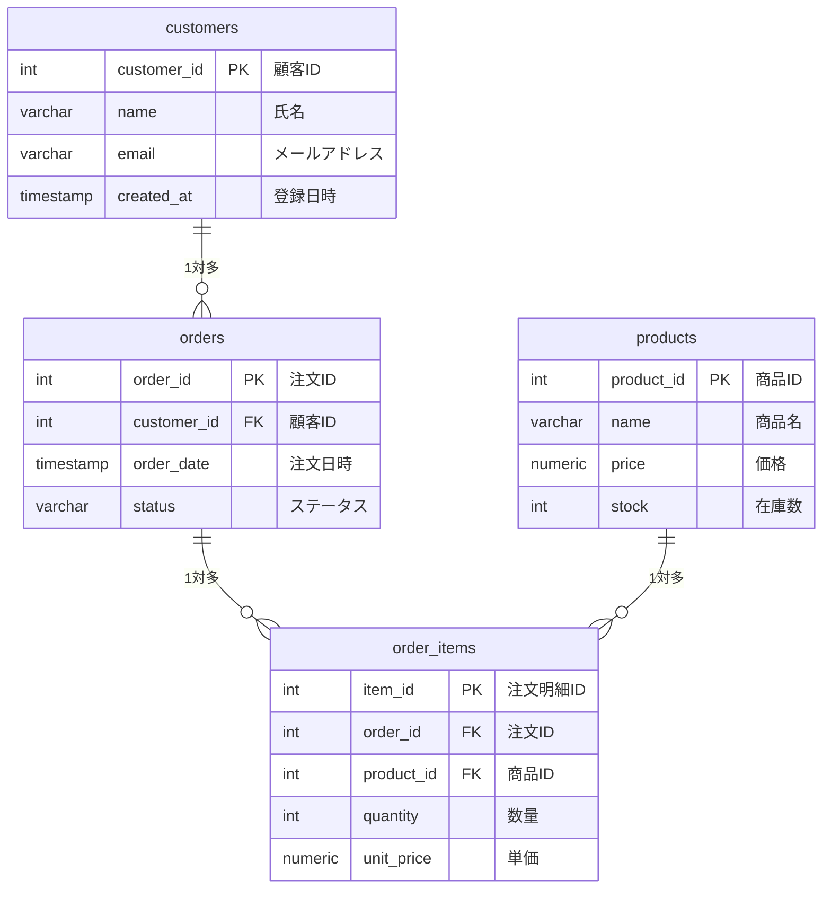

## SQL練習アプリ
- SQLを書けるように練習したいが、自分で一からDB内容を作成するのは大変で手軽に始めたい、という方向けのSQL練習アプリです。
- DBの内容は架空のECサイトをイメージして作成したもので、内容は全てフィクションです。

---
### 用意したDB内容(ER図)

### ordersテーブルのstatusについて

| status | 意味 |
|---|---|
| pending | 注文受付 |
| shipped | 発送済み |
| delivered | 配達完了 |
| cancelled | キャンセル |

---
### ローカルでの実行方法
1. Docker環境を用意する
2. ご自分の環境に当リポジトリをgit cloneする
3. .env.exampleをコピーして.envファイルを作成する
`cp .env.example .env`
4. `docker compose up --build`
5. "http://localhost:8080" でブラウザを起動する
6. textbox内に試したいSQLを入力する
7. SQL実行の際は「実行」ボタンをクリック(※Enterキーでは実行されません)
8. 「データベースリセット」ボタンで、起動時のDB環境に戻せます

---
### 使用技術
- Java 21 / Servlet / JSP
- JDBC / PostgreSQL 16
- Apache Tomcat 10.1
- Maven
- Docker / Docker Compose

---
### セキュリティについて
- Webアプリとしてデプロイした際には.envを公開していないので、クライアントはブラウザからpublic DBにアクセスできないようになっていました。
- ローカル環境ではADMIN_PASSWORDを公開していますので、postgreユーザーとしてpublic DBにログインすることが可能です。
- SQLに慣れてきてCREATEやGRANTなどを試したい、という方は通常のPostgreSQLとしても使用できますので、dockerコンテナ上でPostgreSQLにログインし色々な操作をお試しください！(ただし現在のデフォルトのDBの内容を書き換えた場合、ブラウザからデータベースリセットをしても現状のPostgreSQLの内容が反映されますのでご注意ください)
